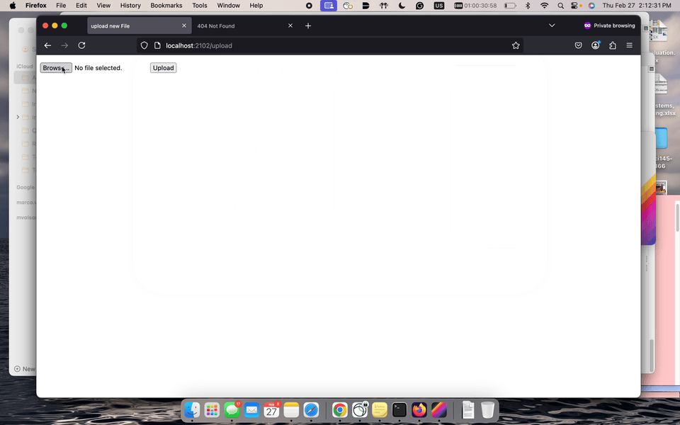

# Flask on Docker

## Overview
This repository demonstrates how to containerize a Flask application integrated with PostgreSQL, Gunicorn, and Nginx for a production-ready deployment. The project shows how to build a full-stack microservice using Docker Compose, handle static and media files, and implement secure practices such as running processes as non-root. Below is a GIF demo of the image upload functionality in action:




## Build Instructions
Follow these steps to bring up the service locally:

1. **Clone the Repository:**
   ```bash
   git clone https://github.com/your-username/flask-on-docker.git
   cd flask-on-docker
   ```

2. **Bring Down Existing Containers (if any):**
   ```bash
   docker-compose -f docker-compose.prod.yml down -v
   ```

3. **Build and Start the Services:**
   ```bash
   docker-compose -f docker-compose.prod.yml up -d --build
   ```

4. **Initialize the Database:**
   ```bash
   docker-compose -f docker-compose.prod.yml exec web python manage.py create_db
   ```

5. **(Optional) Seed the Database:**
   ```bash
   docker-compose -f docker-compose.prod.yml exec web python manage.py seed_db
   ```

6. **Access the Application:**
   - **Production (via Nginx):** Open your browser and navigate to [http://localhost:2102](http://localhost:2102).
   - **Directly (Flask/Gunicorn):** Open your browser and navigate to [http://localhost:2101](http://localhost:2101).

7. **Upload an Image:**
   To test the image upload functionality, go to [http://localhost:2101/upload](http://localhost:2101/upload), choose the file `Demo.GIF` from your local system, and click the upload button.

These instructions provide a complete guide for setting up and running the service, making it easy to demonstrate your work to potential employers.
````markdown

